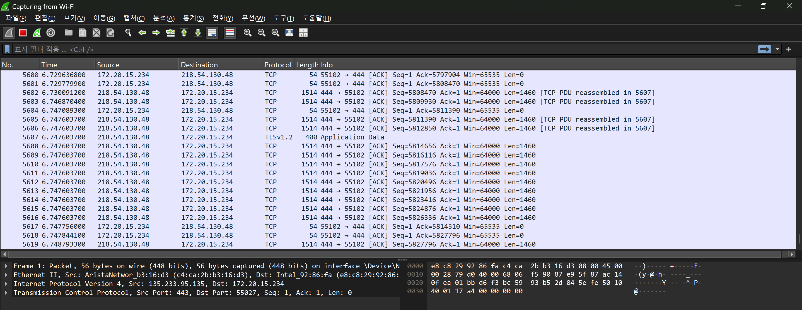
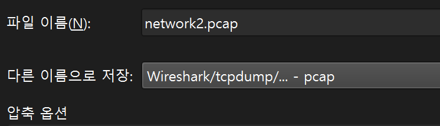
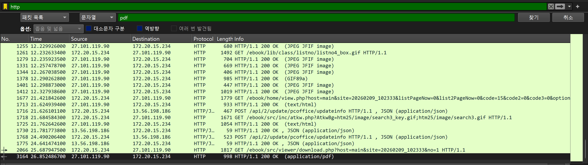
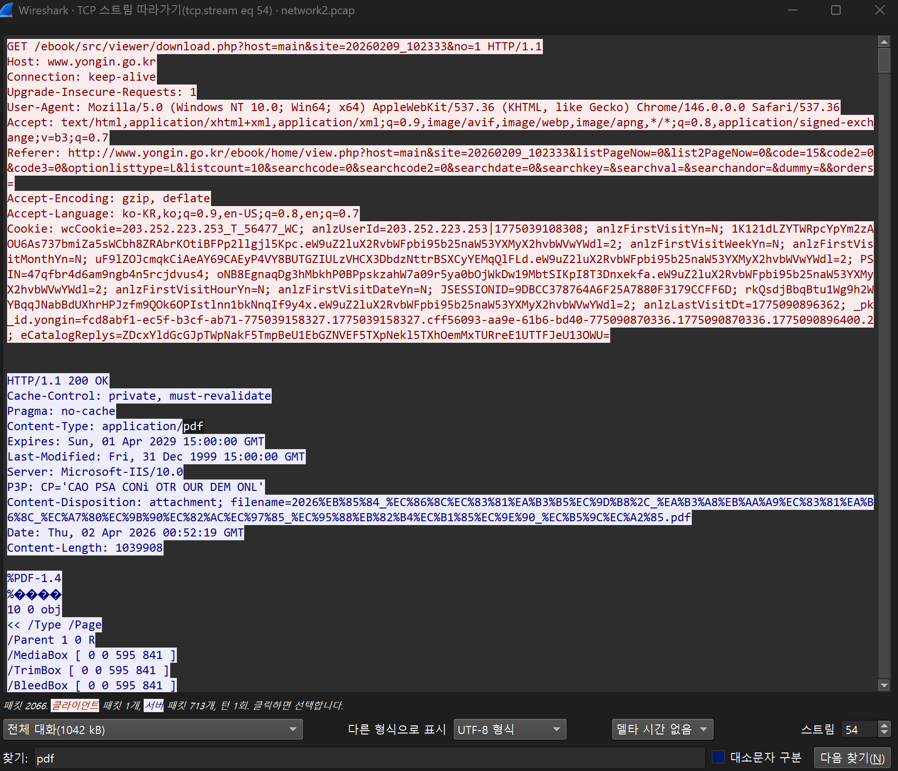
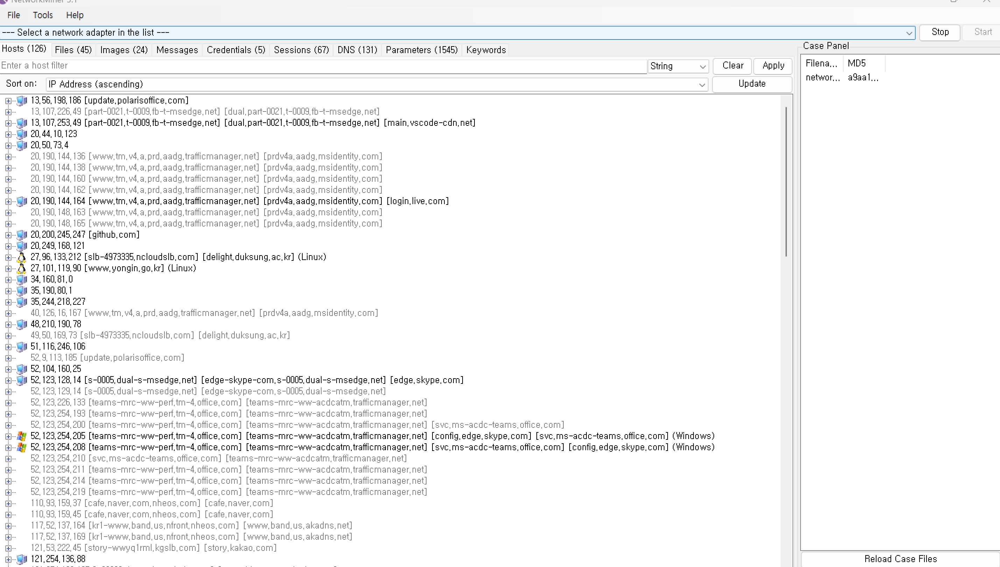
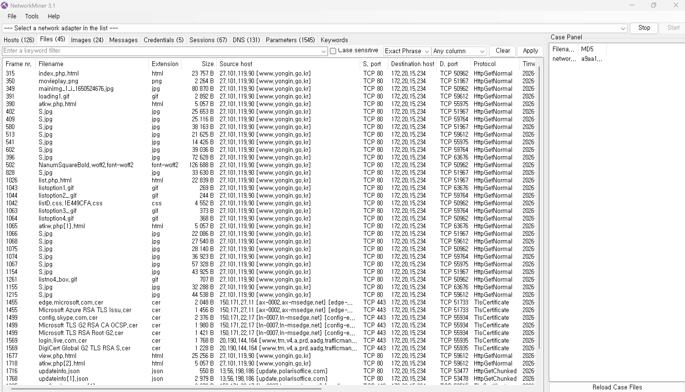
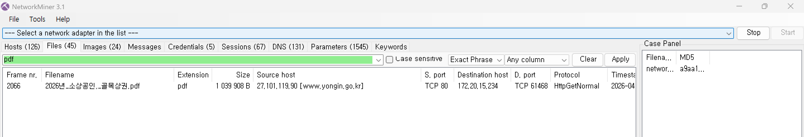
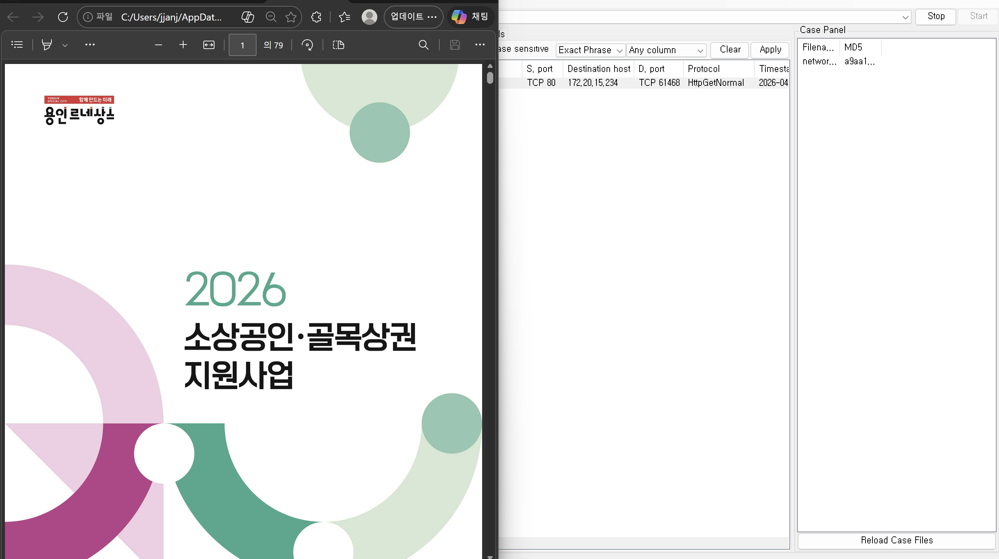

# 네트워크 보안(2) 과제

### 🕵️‍♂️ Network Forensics: HTTP 패킷 분석 및 파일 복구 실습

### 1. 실습 개요

- **목적**: 암호화되지 않은 HTTP 통신에서 전송되는 데이터를 캡처하고, 네트워크 포렌식 도구를 활용해 원본 파일을 복구
- **사용 도구**: `Wireshark` (패킷 캡처 및 분석), `NetworkMiner` (파일 추출 및 포렌식)
- **대상**: 용인시청 홈페이지 내 PDF 다운로드 트래픽

---

<aside>
💡

**NetworkMiner?**

- Windows용 [오픈 소스](https://www.netresec.com/?page=NetworkMinerSourceCode) NFAT(Network Forensic Analysis Tool) → 네트워크 포렌식에 특화
- 네트워크에 트래픽을 발생시키지 않고 **운영 체제, 세션, 호스트 이름, 열린 포트 등을 감지**하기 위해 수동 네트워크 스니퍼/패킷 캡처 도구로 사용 가능
- 오프라인 분석을 위해 PCAP 파일을 구문 분석하고 **PCAP 파일에서 전송된 파일과 인증서를 재생성/재조립**
</aside>

### 2. 패킷 캡처 및 데이터 수집

**2.1 환경설정**



> 노션에 올라와있는 `.pcap` 파일이 열리지 않아 직접 다시 파일을 다운받기로 했다. 관리자모드로 Wireshark를 실행한 후 WIFI 모드로 들어갔다.
> 

**2.2 보안 요소 제거**


> 역시 `HTTPS` 프로토콜에서 보안 연결이 강제되지 않는 취약 경로인  `HTTP` 프로토콜로 변경한 뒤 아무 PDF 파일이나 다운받았다.
> 

**2.3 저장**



> 캡처된 트래픽을 `.pcap` 확장자로 설정해 따로 저장해줬다.
> 

---

### 3. Wireshark를 통한 트래픽 상세 분석



> NetworkMiner로 파일을 복구하기 전에, 캡처된 파일에서 PDF 확장자로 저장된 파일을 찾아주었다.
> 



> 파일을 찾으면 우클릭 후, 따라가기 → TCP 스트림 탭을 클릭하면 이렇게 파일에 대한 request와 response 응답이 뜨는 것을 볼 수 있다. 즉, 색상에 따른 구분은 통신의 방향성에 따른 구분이라고 할 수 있다.
> 

<aside>
✅

**빨간색 코드:** 클라이언트(사용자 PC)가 서버에 데이터를 요청하는 요청 메세지

**파란색 코드:** 서버가 요청을 받고 클라이언트에게 데이터를 전달하는 메세지

</aside>

**3.1 HTTP Request**

> 조금 더 자세히 살펴보자. 우선 빨간색 헤더 코드를 살펴보면 이렇게 나타나있다.
> 

```c
GET /ebook/src/viewer/download.php?host=main&site=20260209_102333&no=1 HTTP/1.1
Host: www.yongin.go.kr
Connection: keep-alive
Upgrade-Insecure-Requests: 1
User-Agent: Mozilla/5.0 (Windows NT 10.0; Win64; x64) AppleWebKit/537.36 (KHTML, like Gecko) Chrome/146.0.0.0 Safari/537.36
Accept: text/html,application/xhtml+xml,application/xml;q=0.9,image/avif,image/webp,image/apng,*/*;q=0.8,application/signed-exchange;v=b3;q=0.7
Referer: http://www.yongin.go.kr/ebook/home/view.php?host=main&site=20260209_102333&listPageNow=0&list2PageNow=0&code=15&code2=0&code3=0&optionlisttype=L&listcount=10&searchcode=0&searchcode2=0&searchdate=0&searchkey=&searchval=&searchandor=&dummy=&&orders=
Accept-Encoding: gzip, deflate
Accept-Language: ko-KR,ko;q=0.9,en-US;q=0.8,en;q=0.7
Cookie: wcCookie=203.252.223.253_T_56477_WC; anlzUserId=203.252.223.253|1775039108308; anlzFirstVisitYn=N; 1K121dLZYTWRpcYpYm2zAOU6As737bmiZa5sWCbh8ZRAbrKOtiBFPp2llgjl5Kpc.eW9uZ2luX2RvbWFpbi95b25naW53YXMyX2hvbWVwYWdl=2; anlzFirstVisitWeekYn=N; anlzFirstVisitMonthYn=N; uF9lZOJcmqkCiAeAY69CAEyP4VY8BUTGZIULzVHCX3DbdzNttrBSXCyYEMqQlFLd.eW9uZ2luX2RvbWFpbi95b25naW53YXMyX2hvbWVwYWdl=2; PSIN=47qfbr4d6am9ngb4n5rcjdvus4; oNB8EgnaqDg3hMbkhP0BPpskzahW7a09r5ya0bOjWkDw19MbtSIKpI8T3Dnxekfa.eW9uZ2luX2RvbWFpbi95b25naW53YXMyX2hvbWVwYWdl=2; anlzFirstVisitHourYn=N; anlzFirstVisitDateYn=N; JSESSIONID=9DBCC378764A6F25A7880F3179CCFF6D; rkQsdjBbqBtu1Wg9h2WYBqqJNabBdUXhrHPJzfm9QOk6OPIstlnn1bkNnqIf9y4x.eW9uZ2luX2RvbWFpbi95b25naW53YXMyX2hvbWVwYWdl=2; anlzLastVisitDt=1775090896362; _pk_id.yongin=fcd8abf1-ec5f-b3cf-ab71-775039158327.1775039158327.cff56093-aa9e-61b6-bd40-775090870336.1775090870336.1775090896400.2; eCatalogReplys=ZDcxYldGcGJpTWpNakF5TmpBeU1EbGZNVEF5TXpNekl5TXhOemMxTURreE1UTTFJeU13OWU=

```

| **항목** | **내용** | **의미** |
| --- | --- | --- |
| **Method** | `GET` | 데이터를 가져오기 위한 요청 방식 |
| **Host** | `www.yongin.go.kr` | 대상 서버의 도메인 주소 |
| **User-Agent** | `Mozilla/5.0...` | 사용자의 OSㅁ 및 브라우저 정보 (공격자 식별 시 활용) |
| **Referer** | `http://www.yongin.go.kr/...` | 요청이 발생한 이전 페이지 (유입 경로 확인), 이 실습의 경우 다운로드 버튼을 누르며 머물렀던 페이지에 해당 |
| **Cookie** | `JSESSIONID=...` | 사용자 식별을 위해 브라우저에 저장된 값 |

**3.2 HTTP Response**

> 다음으로 파란색으로 쓰인 헤더 코드를 살펴보면 아래와 같다.
> 

```c
HTTP/1.1 200 OK
Cache-Control: private, must-revalidate
Pragma: no-cache
Content-Type: application/pdf
Expires: Sun, 01 Apr 2029 15:00:00 GMT
Last-Modified: Fri, 31 Dec 1999 15:00:00 GMT
Server: Microsoft-IIS/10.0
P3P: CP='CAO PSA CONi OTR OUR DEM ONL'
Content-Disposition: attachment; filename=2026%EB%85%84_%EC%86%8C%EC%83%81%EA%B3%B5%EC%9D%B8%2C_%EA%B3%A8%EB%AA%A9%EC%83%81%EA%B6%8C_%EC%A7%80%EC%9B%90%EC%82%AC%EC%97%85_%EC%95%88%EB%82%B4%EC%B1%85%EC%9E%90_%EC%B5%9C%EC%A2%85.pdf
Date: Thu, 02 Apr 2026 00:52:19 GMT
Content-Length: 1039908
```

| **항목** | **내용** | **의미** |
| --- | --- | --- |
| **Status Code** | `200 OK` | 요청이 성공적으로 처리됨 |
| **Content-Type** | `application/pdf` | 전송되는 데이터가 PDF 파일 |
| **Content-Disposition** | `attachment; filename=...` | 브라우저가 파일을 저장하도록 지시하며 파일명 지정, 이 실습에서는 파일을 다운로드하라는 지시. |
| **Content-Length** | `1039908` | 전달되는 파일의 전체 크기 (바이트 단위) |

---

### 4. NetworkMiner를 활용한 파일 복구

**4.1 파일 로드 및 자동 파싱**



> 이제 패킷 분석을 완료했으니 NetworkMiner를 실행해 `.pcap` 파일, 즉 패킷 형태로 저장된 파일을 PDF 파일로 복구해 열어보도록 하겠다.
> 

> `Ctrl+O` 단축키로 저장된 `network2.pcap` 파일을 열어주었다. 파일을 열게 되면 자동적으로 패킷이 분석되는 것을 확인할 수 있다.
> 

**4.2 파일 추출**



> 상단 바 중 `Files` 탭을 눌러 살펴보면 패킷을 캡처하는 과정에서 저장된 파일들을 볼 수 있다.
> 



> 그 중 용인시 홈페이지에서 다운로드해 패킷 분석의 대상이었던 파일의 확장자인 PDF 파일을 찾아주었다.
> 

**4.3 파일 복구 확인**



> 해당 파일을 더블클릭하게 되면 패킷 파일이 PDF 파일로 복구되어 나타남을 확인할 수 있다.
> 

---

### 5. 실습 결론

<aside>
✅

**확인할 수 있는 보안 취약점:** HTTP 통신은 평문(Plaintext)으로 데이터가 전송되므로, 스니핑(Sniffing)을 통해 사용자의 다운로드 내역뿐만 아니라 파일의 원본까지 그대로 노출될 수 있음

- 스니핑: 네트워크상에 흘러 다니는 패킷을 몰래 엿보는 도청 행위로, 수동적 공격에 해당
    - 무차별 모드(Promiscuous Mode)에서만 동작하며, 자신과 상관없는 모든 패킷을 분석
    - 흔적을 남기지 않아 탐지가 어려운 편에 속함
</aside>

<aside>
🛡️

**보안 대응책:** 

- HTTPS 프로토콜을 적용하여 통신 구간을 암호화
    
    → B/C HTTP 프로토콜은 암호화되지 않아 중간에 통신이 가로채질 가능성이 매우 높음
    
- 중요 문서는 서버 측에서 접근 제어 및 암호화 처리가 필요
    
    → B/C 서버 내 파일에 대한 인가 확인이 누락될 경우 URL 추측만으로도 기밀 데이터가 유출될 수 있음
    
</aside>

### 최종 실습 보고

# 1. 기본 분석

`*network2.pcap` 패킷 데이터 분석에 사용된 주요 프로토콜*

- **Ethernet**: 데이터 링크 계층(L2)의 프레임 전송을 위한 프로토콜
- **IPv4 (Internet Protocol version 4)**: 네트워크 계층(L3)에서 호스트 간 데이터 전송을 담당
- **TCP (Transmission Control Protocol)**: 전송 계층(L4)에서 신뢰성 있는 연결 지향적 통신 제공
- **HTTP (Hypertext Transfer Protocol)**: 응용 계층(L7)에서 웹 콘텐츠(PDF)를 요청하고 응답받는 프로토콜

# 2. 웹 요청 분석

- **PDF 다운로드 요청 확인**: Wireshark의 `Follow TCP Stream` 기능을 통해 `.pdf` 파일을 요청하는 GET 메시지를 식별함.
- **전체 URL**: `http://www.yongin.go.kr/ebook/src/viewer/download.php?host=main&site=20260209_102333&no=1`
- **요청 방식(Method)**: `GET`

# 3. 서버 응답 분석

- **파일의 종류**: `application/pdf` (HTTP Header의 `Content-Type` 확인)
- **파일 크기**: `1,039,908` Bytes (약 1.04 MB)
- **파일 이름**: `2026년_소상공인,_골목상권_지원사업_안내책자_최종.pdf`

# 4. 파일 복구

*NetworkMiner를 사용해 패킷 내에 포함된 바이너리 데이터를 실제 파일로 복구*

**4.1 파일 로드 및 자동 파싱**


> NetworkMiner 실행 후 `Ctrl+O` 단축키 또는 `File > Open`을 통해 미리 저장해둔 `network2.pcap` 파일을 불러옴
> 

**4.2 자동 세션 분**


> 도구가 패킷 내 호스트와 파일을 자동으로 분석하며, 특히 전송된 개체들을 `Files` 탭으로 분류
> 

**4.3 파일 식별**


> 상단 바의 `Files` 탭을 클릭한 뒤, 분석 대상이었던 `Extension: PDF` 항목과 `Hostname: www.yongin.go.kr` 항목을 대조하여 찾음
> 

**4.4 파일 복구 확인**


> 리스트에 나타난 해당 PDF 파일을 더블클릭한 뒤, NetworkMiner는 조각난 TCP 세그먼트를 재조합하여 원본 PDF 파일로 복구하고 로컬 뷰어를 통해 실행
>